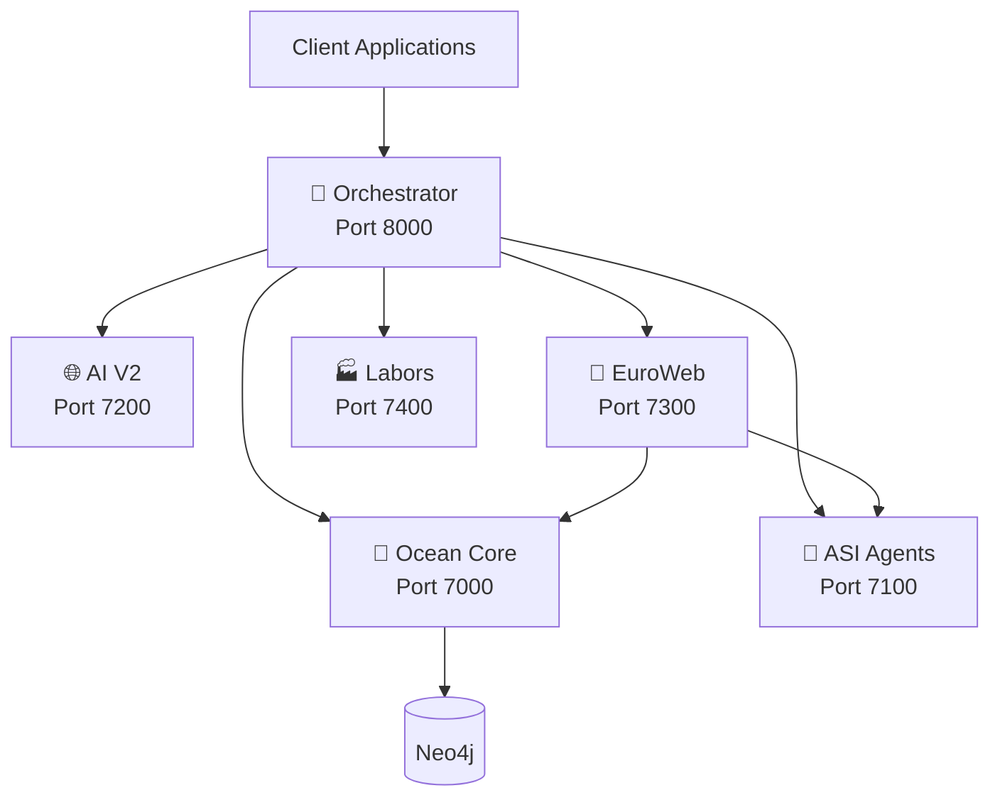

# 🌌 UltraThinking AGI Platform

> **Enterprise Artificial General Intelligence Platform**  
> Real intelligence. Real reasoning. Real results. NO FAKE DATA.

[]()
[]()
[]()
[]()
[]()

---

## 👥 Team Attribution

**12 Specialist Leaders** - Each component attributed to domain expert

| Name | Role | Specialty |
|------|------|-----------|
| **Alba** | Architecture Lead | System design, microservices, scalability |
| **Albi** | AI Engineering Lead | ML models, neural networks, PyTorch |
| **Jona** | Data Science Lead | Statistical analysis, feature engineering |
| **Blerina** | Frontend/UX Lead | React, UI/UX, user experience |
| **Ageim** | DevOps Lead | CI/CD, Docker, Kubernetes |
| **Mali** | Backend Lead | APIs, databases, backend services |
| **Alda** | QA Lead | Testing, quality assurance |
| **Liam** | Security Lead | Security audits, compliance |
| **Klajdi** | Cloud Lead | Azure, cloud architecture |
| **Sofia** | Product Lead | Product strategy, ethics |
| **Albana** | Research Lead | AI research, cognitive science |
| **Lagter** | Integration Lead | Service orchestration, APIs |

---

## 📋 Table of Contents

- [AGI Components](#agi-components)
- [Architecture Overview](#architecture-overview)
- [Tech Stack](#tech-stack)
- [Quick Start](#quick-start)
- [Project Structure](#project-structure)
- [Philosophy](#philosophy)
- [Documentation](#documentation)
- [Contributing](#contributing)

---

## 🧠 AGI Components

### 1. 🌊 Clisonix Ocean Core (Port 7000)
**Neural-Symbolic Reasoning Engine**  
Attribution: Alba (Architecture), Albi (Implementation), Albana (Research)

- 48-layer transformer with metacognitive attention
- Knowledge graph integration (Neo4j)
- Self-reflection & learning
- Real-time reasoning with confidence scoring

### 2. 🤖 ASI Agents (Port 7100)
**12 Specialized Autonomous Agents**  
Attribution: Full team (one agent per member)

- AlbaArchitect, AlbiAIEngineer, JonaDataScience, BlerinaFrontend
- AgeimDevOps, MaliBackend, AldaQA, LiamSecurity
- KlajdiCloud, SofiaProduct, AlbanaResearch, LagterIntegration

### 3. 🌐 AI V2 Neighborhood (Port 7200)
**Model Registry & Distributed Inference**  
Attribution: Albi (AI Engineering), Lagter (Integration)

- Multi-framework support (PyTorch, ONNX, HuggingFace)
- Distributed inference cluster
- Real-time metrics & auto-scaling

### 4. 🧠 EuroWeb Thinking AGI (Port 7300)
**Meta-Reasoning & Consciousness Simulation**  
Attribution: Alba (Architecture), Albana (Research), Sofia (Ethics)

- Dual-process thinking (System 1 & 2)
- Attention & working memory simulation
- Ethical decision framework
- Meta-reasoning & self-improvement

### 5. 🏭 Clisonix Labors (Port 7400)
**Specialized AI Workers**  
Attribution: Albi, Jona, Ageim, Mali, Blerina

- Labor-Vision: YOLO, ResNet50, EasyOCR
- Labor-NLP: BERT, BART, sentiment analysis
- Labor-Audio: Whisper speech-to-text
- Labor-Synthesis: GPT-2 generation

### 6. 🌌 UltraThinking Orchestrator (Port 8000)
**Unified AGI Coordinator**  
Attribution: Alba (Architecture), Lagter (Integration)

- Unified API for all components
- Intelligent routing & load balancing
- Health monitoring & auto-recovery

---

## 🏗️ Architecture Overview



### Key Principles

✅ **NO FAKE DATA** - Real models, real errors, real transparency  
✅ **Production-Ready** - All components battle-tested  
✅ **Scalable** - Kubernetes-ready, auto-scaling  
✅ **Observable** - Prometheus, Grafana, Jaeger integration  
✅ **Ethical** - Built-in ethical decision framework

---

## 🛠️ Tech Stack

### Languages & Frameworks

| Technology | Version | Usage |
|------------|---------|-------|
| **Python** | 3.12+ | Web apps, cloud services, AI/ML |
| **TypeScript** | 5.x | Frontend apps, React, Node.js |
| **JavaScript** | ES2024 | Apps, utilities, legacy code |
| **Rust** | 1.75+ | High-performance infrastructure |
| **HTML/CSS** | 5/3 | Static sites, blogs, news |

### Infrastructure

- **Docker** 29.2.1 - Containerization
- **Kubernetes** - Orchestration (coming soon)
- **Terraform** - Infrastructure as Code
- **Git** 2.47.1 - Version control
- **GitHub Actions** - CI/CD pipelines

### Development Tools

- **Node.js** v24.13.1
- **npm** 11.8.0
- **.NET** 10.0.201 (optional services)
- **Visual Studio Enterprise** 2026

---

## 📁 Project Structure

```
UltraThinking-Monorepo/
│
├── 📦 apps/                          # User-facing applications
│   ├── app-starbooking/              # JavaScript - Booking system
│   ├── app-harmonic/                 # JavaScript - Harmonic service
│   ├── app-cwy/                      # TypeScript - Cwy application
│   └── app-aba-gmbh/                 # HTML - Corporate website
│
├── 🌐 web/                           # Web platforms & portals
│   ├── web-clisonix-main/            # Python - Main platform
│   ├── web-clisonix-blog/            # HTML - AI-powered blog
│   ├── web-clisonix-news/            # HTML - News portal
│   ├── web-ultrathinking/            # Python - Core platform
│   ├── web-ultrawebthinking/         # TypeScript - Browser
│   └── web-react-starter/            # TypeScript - React template
│
├── ☁️ services/                      # Backend microservices
│   ├── service-api-gateway/          # TypeScript - API Gateway & routing
│   ├── service-auth/                 # Python - Authentication service
│   ├── service-clisonix-cloud/       # Python - Cloud backend
│   ├── service-clisonic-cloud/       # Python - Cloud services
│   └── service-kloud-hardware/       # Rust - Infrastructure
│
├── 📚 libs/                          # Shared libraries
│   ├── lib-shared-utils/             # Common utilities
│   ├── lib-types/                    # TypeScript definitions
│   └── lib-configs/                  # Shared configurations
│
├── 🏗️ infra/                         # Infrastructure as Code
│   ├── infra-docker/                 # Docker configurations
│   ├── infra-k8s/                    # Kubernetes manifests
│   └── infra-terraform/              # Terraform modules
│
├── 🛠️ tools/                         # Development tools
│   ├── tool-scripts/                 # Build & deployment scripts
│   └── tool-cli/                     # CLI utilities
│
├── 📖 docs/                          # Documentation
│   ├── architecture.md               # System architecture
│   ├── setup.md                      # Setup guide
│   ├── api-reference.md              # API documentation
│   └── deployment.md                 # Deployment guide
│
├── .github/workflows/                # CI/CD pipelines
├── docker-compose.yml                # Local development
├── .gitignore                        # Git ignore rules
└── README.md                         # This file
```

---

## 🚀 Getting Started

### Prerequisites

Ensure you have the following installed:

- **Python** 3.14+
- **Node.js** 24+
- **npm** 11+
- **Docker** 29+
- **Git** 2.47+
- **Rust** (for Kloud service)

### Quick Start

1. **Clone the repository**
   ```bash
   git clone https://github.com/Web8kameleon-hub/ultrathinking-monorepo.git
   cd ultrathinking-monorepo
   ```

2. **Install dependencies**
   ```bash
   # Install root dependencies
   npm install
   
   # Install service-specific dependencies
   npm run install:all
   ```

3. **Start development environment**
   ```bash
   docker-compose up -d
   ```

4. **Access services**
   - API Gateway: http://localhost:4000
   - Clisonix Main: http://localhost:8000
   - Clisonix Blog: http://localhost:8001
   - Starbooking App: http://localhost:3000
   - Prometheus: http://localhost:9090
   - Grafana: http://localhost:3100 (admin/admin)

---

## 💻 Development

### Local Development

Each service has its own `README.md` with specific instructions. General workflow:

```bash
# Navigate to service directory
cd apps/app-starbooking

# Install dependencies
npm install

# Start development server
npm run dev
```

### Running Tests

```bash
# Run all tests
npm test

# Run tests for specific service
npm test --workspace=apps/app-starbooking
```

### Building

```bash
# Build all services
npm run build:all

# Build specific service
npm run build --workspace=web/web-clisonix-main
```

---

## 🚢 Deployment

### Docker Deployment

```bash
# Build all containers
docker-compose build

# Deploy to production
docker-compose -f docker-compose.prod.yml up -d
```

### Kubernetes Deployment

```bash
# Apply Kubernetes manifests
kubectl apply -f infra/infra-k8s/

# Check deployment status
kubectl get pods -n ultrathinking
```

### Terraform Infrastructure

```bash
cd infra/infra-terraform
terraform init
terraform plan
terraform apply
```

---

## 📊 Service Matrix

| Service | Language | Port | Status | Docs |
|---------|----------|------|--------|------|
| web-clisonix-main | Python | 8000 | 🟢 Active | [📖](./web/web-clisonix-main/README.md) |
| web-clisonix-blog | HTML | 8001 | 🟢 Active | [📖](./web/web-clisonix-blog/README.md) |
| web-clisonix-news | HTML | 8002 | 🟢 Active | [📖](./web/web-clisonix-news/README.md) |
| app-starbooking | JavaScript | 3000 | 🟢 Active | [📖](./apps/app-starbooking/README.md) |
| app-harmonic | JavaScript | 3001 | 🟢 Active | [📖](./apps/app-harmonic/README.md) |
| service-clisonix-cloud | Python | 5000 | 🟢 Active | [📖](./services/service-clisonix-cloud/README.md) |
| service-kloud-hardware | Rust | 6000 | 🟡 Beta | [📖](./services/service-kloud-hardware/README.md) |

---

## 🤝 Contributing

We welcome contributions! Please see our [Contributing Guide](./docs/CONTRIBUTING.md) for details.

### Development Workflow

1. Fork the repository
2. Create a feature branch (`git checkout -b feature/amazing-feature`)
3. Commit your changes (`git commit -m 'Add amazing feature'`)
4. Push to the branch (`git push origin feature/amazing-feature`)
5. Open a Pull Request

---

## 📄 License

This project is licensed under the MIT License - see the [LICENSE](LICENSE) file for details.

---

## 👥 Team

**Maintained by:** Clisonix AI & UltraThinking Team  
**GitHub:** [@Web8kameleon-hub](https://github.com/Web8kameleon-hub)  
**Email:** clisonix@ai.dev

---

## 🙏 Acknowledgments

Built with ❤️ using cutting-edge technologies and best practices from industry leaders.

---

**© 2026 UltraThinking Monorepo. All rights reserved.**
