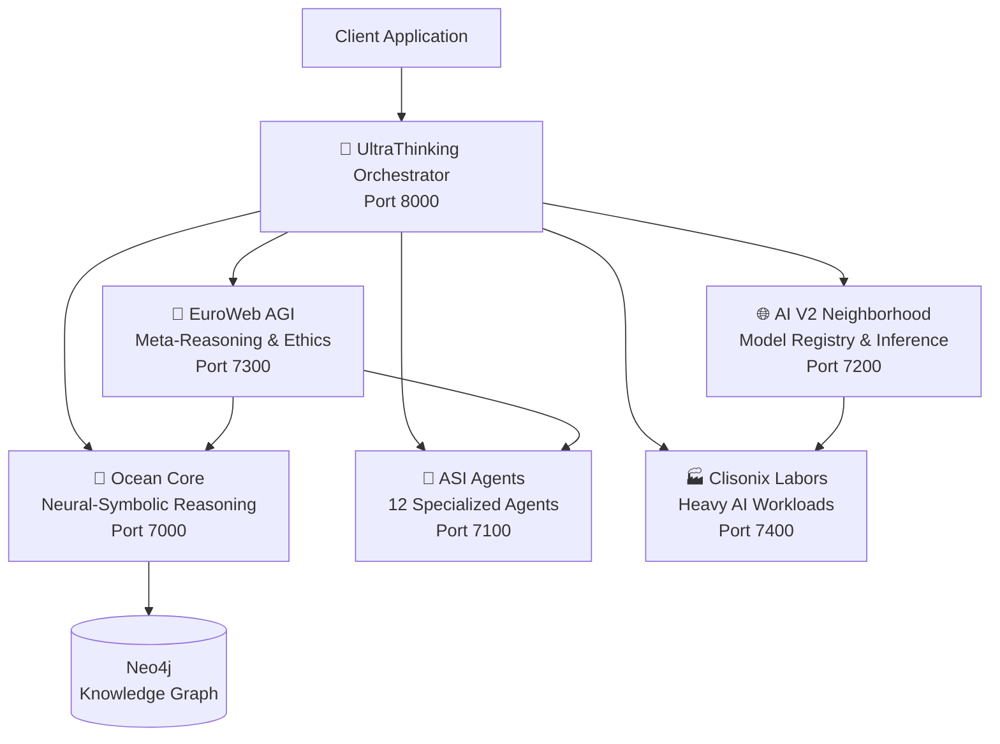

# 🌌 UltraThinking AGI Platform - Complete Documentation

## 🎯 Platform Overview

**UltraThinking** është një platformë **enterprise-grade AGI** (Artificial General Intelligence) që kombinon:

- **Neural-symbolic reasoning** (Ocean Core)
- **Multi-agent orchestration** (ASI Agents)
- **Distributed model inference** (AI V2 Neighborhood)
- **Consciousness simulation** (EuroWeb AGI)
- **Specialized AI workers** (Clisonix Labors)

### 🏆 Team Attribution

| Name | Role | Specialty |
|------|------|-----------|
| **Alba** | Architecture Lead | System design, microservices, scalability |
| **Albi** | AI Engineering Lead | ML models, neural networks, PyTorch |
| **Jona** | Data Science Lead | Statistical analysis, feature engineering |
| **Blerina** | Frontend/UX Lead | React, UI/UX, user experience |
| **Ageim** | DevOps Lead | CI/CD, Docker, Kubernetes, infrastructure |
| **Mali** | Backend Lead | APIs, databases, backend services |
| **Alda** | QA Lead | Testing, quality assurance, automation |
| **Liam** | Security Lead | Security audits, encryption, compliance |
| **Klajdi** | Cloud Infrastructure Lead | Azure, AWS, cloud architecture |
| **Sofia** | Product Management Lead | Product strategy, ethics, roadmap |
| **Albana** | Research Lead | AI research, cognitive science, innovation |
| **Lagter** | Integration Lead | Service integration, API orchestration |

---

## 🧠 Core Components

### 1. 🌊 Clisonix Ocean Core

**Neural-Symbolic Reasoning Engine**

**Attribution:** Alba (Architecture), Albi (Implementation), Albana (Research)

**Features:**
- 48-layer transformer with metacognitive attention
- Knowledge graph integration (Neo4j)
- Self-reflection & learning from feedback
- Real-time reasoning with confidence scoring

**Endpoints:**
```bash
POST /api/v1/reason
POST /api/v1/learn
GET  /api/v1/insights
```

**Port:** 7000

**Example Usage:**
```python
import httpx

response = httpx.post(
    "http://localhost:7000/api/v1/reason",
    json={
        "query": "Design a scalable microservices architecture",
        "enable_reflection": True
    }
)

result = response.json()
print(result["answer"])
print(f"Confidence: {result['confidence']}")
```

---

### 2. 🤖 ASI Agents (12 Specialized Agents)

**Autonomous Specialized Intelligence**

**Attribution:** Full team (each agent attributed to respective team member)

**Agents:**

1. **AlbaArchitect** - System architecture & design
2. **AlbiAIEngineer** - ML model training & deployment
3. **JonaDataScience** - Data analysis & feature engineering
4. **BlerinaFrontend** - UI/UX & React components
5. **AgeimDevOps** - CI/CD & infrastructure (TO BE IMPLEMENTED)
6. **MaliBackend** - Backend services & APIs (TO BE IMPLEMENTED)
7. **AldaQA** - Quality assurance & testing (TO BE IMPLEMENTED)
8. **LiamSecurity** - Security audits & compliance (TO BE IMPLEMENTED)
9. **KlajdiCloud** - Cloud infrastructure & scaling (TO BE IMPLEMENTED)
10. **SofiaProduct** - Product strategy & ethics (TO BE IMPLEMENTED)
11. **AlbanaResearch** - AI research & innovation (TO BE IMPLEMENTED)
12. **LagterIntegration** - Service integration & orchestration (TO BE IMPLEMENTED)

**Endpoints:**
```bash
POST /api/v1/agents/{agent_name}/execute
GET  /api/v1/agents/{agent_name}/health
GET  /api/v1/agents/health
POST /api/v1/agents/broadcast
```

**Port:** 7100

**Example Usage:**
```python
import httpx

# Execute task with specific agent
response = httpx.post(
    "http://localhost:7100/api/v1/agents/alba/execute",
    json={
        "type": "design_architecture",
        "requirements": "E-commerce platform with 1M users"
    }
)

result = response.json()
print(result["design"])
```

---

### 3. 🌐 AI V2 Neighborhood

**Model Registry & Distributed Inference Cluster**

**Attribution:** Albi (AI Engineering), Lagter (Integration)

**Features:**
- Model registry with versioning
- Distributed inference (4+ workers)
- Multi-framework support (PyTorch, ONNX, HuggingFace)
- Real-time metrics & monitoring
- Auto-scaling & load balancing

**Endpoints:**
```bash
POST /api/v1/models/register
POST /api/v1/models/{model_id}/predict
GET  /api/v1/models
GET  /api/v1/models/{model_id}
```

**Port:** 7200

**Example Usage:**
```python
import httpx

# Register and deploy model
response = httpx.post(
    "http://localhost:7200/api/v1/models/register",
    json={
        "name": "sentiment-analyzer",
        "version": "1.0.0",
        "framework": "pytorch",
        "artifact_path": "/models/sentiment.pt",
        "replicas": 2
    }
)

model_id = response.json()["model_id"]

# Run prediction
prediction = httpx.post(
    f"http://localhost:7200/api/v1/models/{model_id}/predict",
    json={"inputs": {"text": "This product is amazing!"}}
)

print(prediction.json())
```

---

### 4. 🧠 EuroWeb/UltraWeb Thinking AGI

**Meta-Reasoning & Consciousness Simulation**

**Attribution:** Alba (Architecture), Albana (Research), Sofia (Ethics)

**Features:**
- Dual-process thinking (System 1 & System 2)
- Attention mechanism (Miller's Law: 7±2 items)
- Working memory simulation
- Ethical decision framework
- Meta-reasoning (thinking about thinking)
- Self-improvement loop

**Endpoints:**
```bash
POST /api/v1/think
GET  /api/v1/consciousness/attention
GET  /api/v1/consciousness/working-memory
GET  /api/v1/meta/strategies
```

**Port:** 7300

**Example Usage:**
```python
import httpx

response = httpx.post(
    "http://localhost:7300/api/v1/think",
    json={
        "problem": "How to reduce carbon emissions?",
        "mode": "hybrid",
        "depth": "deep"
    }
)

result = response.json()
print(result["solution"])
print(f"Ethical score: {result['ethical_score']}")
print(f"Strategy used: {result['strategy']}")
```

---

### 5. 🏭 Clisonix Labors

**Specialized AI Workers for Heavy Workloads**

**Attribution:** Albi, Jona, Ageim, Mali, Blerina

**Labor Units:**

#### Labor-Vision (Computer Vision)
- Object detection (YOLO)
- Image classification (ResNet50)
- OCR (EasyOCR)
- **Attribution:** Albi, Jona, Ageim

#### Labor-NLP (Natural Language Processing)
- Sentiment analysis (DistilBERT)
- Named Entity Recognition (BERT)
- Text summarization (BART)
- **Attribution:** Albi, Albana, Jona

#### Labor-Audio (Audio Processing)
- Speech-to-text (Whisper)
- Audio classification
- **Attribution:** Albi, Mali

#### Labor-Synthesis (Content Generation)
- Text generation (GPT-2)
- **Attribution:** Albi, Blerina

**Endpoints:**
```bash
POST /api/v1/labors/{labor_name}/process
GET  /api/v1/labors/health
```

**Port:** 7400

**Example Usage:**
```python
import httpx

# Vision: Detect objects
response = httpx.post(
    "http://localhost:7400/api/v1/labors/vision/process",
    json={
        "type": "detect_objects",
        "image_path": "/data/image.jpg"
    }
)

result = response.json()
print(f"Found {result['count']} objects")
for detection in result["detections"]:
    print(f"- {detection['class']}: {detection['confidence']:.2f}")

# NLP: Sentiment analysis
response = httpx.post(
    "http://localhost:7400/api/v1/labors/nlp/process",
    json={
        "type": "analyze_sentiment",
        "text": "This is an amazing product!"
    }
)

result = response.json()
print(f"Sentiment: {result['sentiment']} ({result['confidence']:.2f})")
```

---

### 6. 🌌 UltraThinking Orchestrator

**Unified AGI Coordinator**

**Attribution:** Alba (Architecture), Lagter (Integration)

**Features:**
- Unified API for all AGI components
- Intelligent routing & load balancing
- Health monitoring & auto-recovery
- Request/response synthesis
- Multi-component orchestration

**Endpoints:**
```bash
POST /api/v1/think
GET  /api/v1/health
GET  /api/v1/team
GET  /
```

**Port:** 8000 (Main entry point)

**Example Usage:**
```python
import httpx

# Unified thinking request
response = httpx.post(
    "http://localhost:8000/api/v1/think",
    json={
        "query": "Design a scalable e-commerce platform",
        "task_type": "design",
        "thinking_mode": "hybrid",
        "depth": "deep",
        "use_agents": True,
        "use_labors": False
    }
)

result = response.json()
print(result["answer"])
print(f"Confidence: {result['confidence']}")
print(f"Components used: {result['components_used']}")
print(f"Processing time: {result['processing_time_ms']}ms")

# Health check
health = httpx.get("http://localhost:8000/api/v1/health").json()
print(f"Overall status: {health['overall_status']}")
```

---

## 🚀 Quick Start

### Prerequisites

- Python 3.12+
- Docker 29.2.1+
- CUDA 12.1+ (optional, for GPU acceleration)
- Neo4j 5.17+ (for knowledge graph)

### Installation

#### 1. Clone Repository

```bash
cd C:\Users\Admin\source\repos\Web8
```

#### 2. Install Dependencies

```bash
# Ocean Core
cd core/clisonix-ocean-core
pip install -r requirements.txt

# ASI Agents
cd ../asi-agents
pip install -r requirements.txt

# AI V2 Neighborhood
cd ../ai-v2-neighborhood
pip install -r requirements.txt

# EuroWeb AGI
cd ../euroweb-agi
pip install -r requirements.txt

# Clisonix Labors
cd ../clisonix-labors
pip install -r requirements.txt

# Orchestrator
cd ../orchestrator
pip install -r requirements.txt
```

#### 3. Start Neo4j (Knowledge Graph)

```bash
docker run -d \
  --name neo4j \
  -p 7474:7474 -p 7687:7687 \
  -e NEO4J_AUTH=neo4j/password \
  neo4j:5.17
```

#### 4. Start Services

```bash
# Terminal 1: Ocean Core
cd core/clisonix-ocean-core
python ocean_core.py

# Terminal 2: ASI Agents
cd core/asi-agents
python agents_registry.py

# Terminal 3: AI V2 Neighborhood
cd core/ai-v2-neighborhood
python model_orchestration.py

# Terminal 4: EuroWeb AGI
cd core/euroweb-agi
python thinking_engine.py

# Terminal 5: Clisonix Labors
cd core/clisonix-labors
python labor_units.py

# Terminal 6: Orchestrator (Main)
cd core/orchestrator
python main.py
```

#### 5. Verify Installation

```bash
curl http://localhost:8000/
curl http://localhost:8000/api/v1/health
```

---

## 📊 System Architecture



---

## 🧪 Testing

### Unit Tests

```bash
# Ocean Core
cd core/clisonix-ocean-core
pytest tests/

# Agents
cd core/asi-agents
pytest tests/

# Orchestrator
cd core/orchestrator
pytest tests/
```

### Integration Tests

```bash
# Full system integration test
cd tests/integration
pytest test_full_pipeline.py
```

### Load Testing

```bash
# Using k6
k6 run tests/load/stress_test.js
```

---

## 📈 Monitoring & Observability

All services integrate with:

- **Prometheus** (Port 9090): Metrics collection
- **Grafana** (Port 3000): Visualization
- **Jaeger** (Port 16686): Distributed tracing
- **Loki** (Port 3100): Log aggregation

Access dashboards:
- Grafana: http://localhost:3000
- Prometheus: http://localhost:9090
- Jaeger: http://localhost:16686

---

## ⚠️ Philosophy: No Fake Data

### Core Principles

1. **Real Errors > Fake Data**
   - `404` if resource doesn't exist
   - `500` if service fails
   - `503` if service unavailable
   - ❌ NO placeholder/mock responses

2. **Transparency First**
   - All errors logged
   - All metrics real
   - All responses from actual models

3. **Observability Critical**
   - Prometheus metrics on all services
   - Distributed tracing required
   - Structured logging mandatory

### Error Handling

```python
# ❌ BAD (hiding error with fake data)
if model_unavailable:
    return {"result": "fake placeholder"}

# ✅ GOOD (real error)
if model_unavailable:
    raise HTTPException(
        status_code=503,
        detail="Model service unavailable"
    )
```

---

## 🔒 Security

**Lead:** Liam (Security)

- JWT authentication on all endpoints
- Rate limiting (100 req/min per IP)
- Input validation (Pydantic)
- SQL injection prevention
- XSS protection
- CORS configured
- Secrets in environment variables

---

## 📦 Production Deployment

**Lead:** Ageim (DevOps), Klajdi (Cloud)

### Docker Compose

```yaml
version: '3.8'

services:
  orchestrator:
    build: ./core/orchestrator
    ports:
      - "8000:8000"
    environment:
      - OCEAN_CORE_URL=http://ocean-core:7000
      - AGENTS_URL=http://agents:7100
      - AI_V2_URL=http://ai-v2:7200
      - EUROWEB_URL=http://euroweb:7300
      - LABORS_URL=http://labors:7400
    depends_on:
      - ocean-core
      - agents
      - ai-v2
      - euroweb
      - labors
  
  ocean-core:
    build: ./core/clisonix-ocean-core
    ports:
      - "7000:7000"
    environment:
      - NEO4J_URI=bolt://neo4j:7687
      - NEO4J_USER=neo4j
      - NEO4J_PASSWORD=${NEO4J_PASSWORD}
    depends_on:
      - neo4j
  
  agents:
    build: ./core/asi-agents
    ports:
      - "7100:7100"
  
  ai-v2:
    build: ./core/ai-v2-neighborhood
    ports:
      - "7200:7200"
  
  euroweb:
    build: ./core/euroweb-agi
    ports:
      - "7300:7300"
  
  labors:
    build: ./core/clisonix-labors
    ports:
      - "7400:7400"
    deploy:
      resources:
        reservations:
          devices:
            - driver: nvidia
              count: all
              capabilities: [gpu]
  
  neo4j:
    image: neo4j:5.17
    ports:
      - "7474:7474"
      - "7687:7687"
    environment:
      - NEO4J_AUTH=neo4j/${NEO4J_PASSWORD}
    volumes:
      - neo4j-data:/data

volumes:
  neo4j-data:
```

### Kubernetes

See `infra/k8s/` for complete Kubernetes manifests.

---

## 📚 API Documentation

Interactive API docs available at:
- Orchestrator: http://localhost:8000/docs
- Ocean Core: http://localhost:7000/docs
- ASI Agents: http://localhost:7100/docs
- AI V2: http://localhost:7200/docs
- EuroWeb: http://localhost:7300/docs
- Labors: http://localhost:7400/docs

---

## 🎯 Roadmap

### Phase 1: Foundation ✅
- Ocean Core implementation
- ASI Agents (4/12 implemented)
- AI V2 Neighborhood
- EuroWeb AGI
- Clisonix Labors
- Unified Orchestrator

### Phase 2: Completion (In Progress)
- Remaining 8 ASI Agents
- Advanced metacognition
- Enhanced ethical framework
- A/B testing for models
- Canary deployments

### Phase 3: Scale
- Multi-region deployment
- Auto-scaling (Kubernetes HPA)
- Service mesh (Istio)
- Global load balancing

### Phase 4: Advanced AI
- Reinforcement learning agents
- Multi-modal models
- Federated learning
- Quantum-ready architecture

---

## 🤝 Contributing

See `CONTRIBUTING.md` for guidelines.

---

## 📄 License

Proprietary - Clisonix AI Platform

---

## 📞 Support

- **Architecture:** Alba
- **AI/ML:** Albi
- **Integration:** Lagter
- **Security:** Liam
- **DevOps:** Ageim

---

**Built with ❤️ by the UltraThinking Team**

*No fake data. Real intelligence. Real results.*
