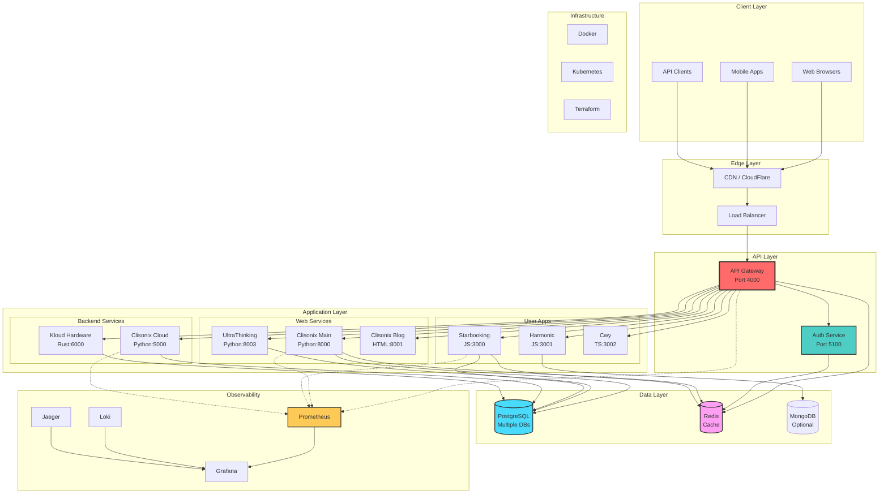

# 🏗️ System Architecture

## Overview

UltraThinking Monorepo follows a **microservices architecture** with clear separation of concerns, enabling independent development, deployment, and scaling of services.

---

## 📊 High-Level Architecture Diagram



---

## 🎯 Architectural Principles

### 1. **Microservices First**
- Each service is independently deployable
- Services communicate via REST APIs and message queues
- No shared databases between services

### 2. **Polyglot Architecture**
- **Python**: Web platforms, AI/ML services, cloud backends
- **TypeScript/JavaScript**: Frontend apps, Node.js APIs
- **Rust**: High-performance infrastructure and hardware services
- **HTML/CSS**: Static content, blogs, documentation

### 3. **Domain-Driven Design**
Services are organized by business domain:
- **Apps**: User-facing applications (booking, harmonic, cwy)
- **Web**: Content platforms (blogs, news, main sites)
- **Services**: Backend infrastructure (cloud, hardware)
- **Libs**: Shared utilities and types

### 4. **Infrastructure as Code**
- Docker for containerization
- Kubernetes for orchestration
- Terraform for cloud provisioning

---

## 📊 Service Communication

```
┌─────────────────────────────────────────────────────────────┐
│                         API Gateway                          │
│                      (Port 4000)                            │
└────────┬──────────────────┬──────────────────┬──────────────┘
         │                  │                  │
         ▼                  ▼                  ▼
┌──────────────┐   ┌──────────────┐   ┌──────────────┐
│   Web Apps   │   │     Apps     │   │   Services   │
├──────────────┤   ├──────────────┤   ├──────────────┤
│ Clisonix     │   │ Starbooking  │   │ Cloud APIs   │
│ UltraThink   │   │ Harmonic     │   │ Kloud HW     │
│ React Apps   │   │ Cwy          │   │ Storage      │
└──────┬───────┘   └──────┬───────┘   └──────┬───────┘
       │                  │                  │
       └──────────────────┴──────────────────┘
                          │
                          ▼
                 ┌─────────────────┐
                 │ Shared Libraries │
                 ├─────────────────┤
                 │ Utils | Types   │
                 │ Configs         │
                 └─────────────────┘
```

---

## 🗄️ Data Architecture

### Database Strategy

- **PostgreSQL**: Primary relational database
  - User management
  - Booking data
  - Content management

- **Redis**: Caching and sessions
  - API response caching
  - User sessions
  - Rate limiting

- **MongoDB**: Document storage (optional)
  - Logs and analytics
  - Unstructured data

### Data Isolation

Each service has its own database schema or instance:
```
service-clisonix-cloud → PostgreSQL (db_clisonix)
app-starbooking       → PostgreSQL (db_booking)
service-kloud         → PostgreSQL (db_kloud)
```

---

## 🔐 Security Architecture

### Authentication & Authorization

1. **JWT-based Authentication**
   - Tokens issued by auth service
   - Validated by API gateway
   - Distributed to microservices

2. **API Gateway Security**
   - Rate limiting
   - IP whitelisting
   - DDoS protection

3. **Service-to-Service Communication**
   - mTLS (mutual TLS)
   - Service mesh (Istio) for production

### Secrets Management

- Environment variables for development
- Azure Key Vault / HashiCorp Vault for production
- Never commit secrets to Git

---

## 🚀 Deployment Architecture

### Development Environment

```yaml
Docker Compose Setup:
  - All services run locally
  - Shared network
  - Volume mounts for live reload
  - PostgreSQL, Redis containers
```

### Staging Environment

```yaml
Kubernetes Cluster:
  - Namespace: staging
  - Auto-scaling enabled
  - Resource limits enforced
  - CI/CD from develop branch
```

### Production Environment

```yaml
Kubernetes Cluster:
  - Multi-zone deployment
  - High availability (3+ replicas)
  - Load balancing
  - Auto-scaling (HPA)
  - Monitoring & alerting
  - Blue-green deployments
```

---

## 📡 Service Registry

| Service | Type | Language | Port | Health Check |
|---------|------|----------|------|--------------|
| web-clisonix-main | Web | Python | 8000 | /health |
| web-clisonix-blog | Static | HTML | 8001 | /index.html |
| web-clisonix-news | Static | HTML | 8002 | /index.html |
| web-ultrathinking | Web | Python | 8003 | /health |
| web-ultrawebthinking | SPA | TypeScript | 8004 | /health |
| app-starbooking | App | JavaScript | 3000 | /api/health |
| app-harmonic | App | JavaScript | 3001 | /api/health |
| app-cwy | App | TypeScript | 3002 | /api/health |
| service-clisonix-cloud | API | Python | 5000 | /api/v1/health |
| service-clisonic-cloud | API | Python | 5001 | /api/v1/health |
| service-kloud-hardware | API | Rust | 6000 | /health |

---

## 🔄 CI/CD Pipeline

### GitHub Actions Workflow

```
┌──────────────┐
│ Git Push     │
└──────┬───────┘
       │
       ▼
┌──────────────┐
│ Lint & Test  │
└──────┬───────┘
       │
       ▼
┌──────────────┐
│ Build Images │
└──────┬───────┘
       │
       ▼
┌──────────────┐
│ Push to ACR  │
└──────┬───────┘
       │
       ▼
┌──────────────┐
│ Deploy (K8s) │
└──────────────┘
```

---

## 📊 Monitoring & Observability

### Metrics Collection

- **Prometheus**: Time-series metrics
- **Grafana**: Visualization dashboards
- **Loki**: Log aggregation

### Distributed Tracing

- **Jaeger**: Request tracing across services
- **OpenTelemetry**: Instrumentation

### Alerting

- **Alertmanager**: Alert routing
- **PagerDuty**: On-call notifications

---

## 🧩 Technology Stack Summary

### Frontend
- React 18+ (TypeScript)
- Next.js (SSR/SSG)
- Tailwind CSS

### Backend
- Python (FastAPI, Flask)
- Node.js (Express)
- Rust (Actix-web)

### Infrastructure
- Docker & Docker Compose
- Kubernetes (AKS/EKS)
- Terraform

### Databases
- PostgreSQL 16+
- Redis 7+
- MongoDB (optional)

### DevOps
- GitHub Actions
- ArgoCD (GitOps)
- Helm Charts

---

## 📈 Scalability Strategy

### Horizontal Scaling
- Kubernetes HPA (Horizontal Pod Autoscaler)
- Load balancing with NGINX Ingress

### Vertical Scaling
- Resource limits per service
- Node auto-scaling in Kubernetes

### Caching Strategy
- Redis for API responses
- CDN for static assets
- Browser caching headers

---

## 🔮 Future Enhancements

- [ ] Service mesh (Istio)
- [ ] GraphQL federation
- [ ] Event-driven architecture (Kafka)
- [ ] Multi-region deployment
- [ ] AI/ML model serving (TensorFlow Serving)

---

**Last Updated:** April 11, 2026  
**Maintained by:** UltraThinking Architecture Team
